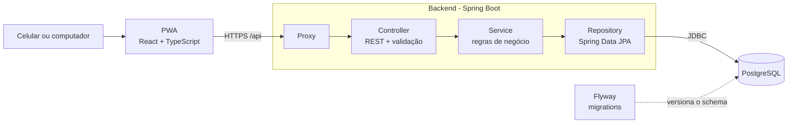

# Visão de arquitetura

> **Status:** planejada. O backend (M1) e o front-end (M3) ainda não existem.
> Este documento é atualizado conforme as decisões são implementadas.

## Visão geral

Monolito em camadas com API REST, banco relacional e um PWA mobile-first
([ADR-0005](../adr/0005-interface-pwa-react.md)).



Em produção o proxy entrega o PWA em `/` e a API em `/api` (mesmo domínio). Em desenvolvimento,
o servidor do Vite faz proxy de `/api` para o backend local.

## Estrutura do repositório

```
easy-finance/
├── backend/    API Java (Spring Boot, Maven)              - M1
├── web/        PWA (React, TypeScript, Vite)              - M3
├── docs/       ADRs, arquitetura, roadmap
├── legacy/     protótipo SQLite congelado
├── tools/      scripts de configuração do GitHub
└── compose.yaml  PostgreSQL local                         - M1
```

## Responsabilidade das camadas (backend)

| Camada | Responsabilidade | Não deve |
|---|---|---|
| Controller | Receber HTTP, validar entrada, converter DTO ↔ domínio, devolver status corretos | Conter regra de negócio ou acessar o banco |
| Service | Regras de negócio, orquestração e transações | Conhecer detalhes de HTTP |
| Repository | Persistência e consultas | Conter regra de negócio |

## Organização de pacotes (backend, por funcionalidade)

Pacote base previsto: `io.github.igorpacheco1.easyfinance`.

```
easyfinance/
├── categoria/     controller, service, repository, entidade, DTOs
├── transacao/     controller, service, repository, entidade, DTOs
├── usuario/       (M5)
├── config/        configurações transversais (segurança, OpenAPI)
└── shared/        tratamento de erros e utilitários comuns
```

Organizar por funcionalidade (e não por camada técnica) mantém o que muda junto no mesmo lugar.

## Princípios

- **Dinheiro** é `BigDecimal` no Java e `NUMERIC(19,2)` no banco, nunca `double`.
- **Datas** de lançamento são `LocalDate`/`DATE`; instantes (criação) em UTC.
- **Identificador** da transação: a definir no M1 (recomendação: UUID, que pode ser gerado no
  cliente para permitir criação idempotente e uso offline).
- **Schema** só muda por migration Flyway. Nunca por `ddl-auto`.
- **Erros** seguem `ProblemDetail` (RFC 9457).
- **API versionada** (`/api/v1/...`), porque o PWA instalado pode ficar desatualizado.
- **Configuração sensível** vem de variáveis de ambiente.
- **Regras de negócio ficam na API**; o front-end só apresenta e envia dados.
