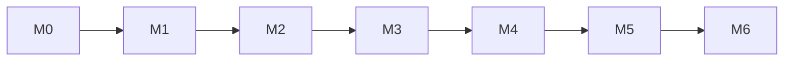

# Roadmap

Cada milestone entrega algo verificável e corresponde a uma versão. As issues estão nos
[milestones do GitHub](https://github.com/IgorPacheco1/Easy-finance/milestones); este documento
mostra a visão geral e o objetivo de cada etapa.

## Foco atual: a base do projeto (M0 a M3)

Os quatro primeiros milestones formam a base: repositório organizado, backend funcionando, API
completa e um **PWA mínimo que já dá para usar localmente**. Só as issues do M0 a M3 estão
detalhadas. Os demais milestones existem, mas são planejados quando chegar a vez deles, com o
aprendizado da base em mãos.

| Milestone | Versão | Objetivo | Entrega verificável |
|---|---|---|---|
| **M0: Fundação** | (nenhuma) | Repositório organizado como projeto profissional | Repo limpo, README honesto, CI ativo, ruleset na `main`, backlog criado |
| **M1: Esqueleto** | v0.1.0 | Base técnica do backend | Spring Boot sobe com Postgres (Docker Compose), Flyway aplica o schema, teste com Testcontainers passa no CI |
| **M2: Núcleo** | v0.2.0 | API de categorias e transações | API documentada (OpenAPI), com validação, erros padronizados, criação idempotente, saldo por período e testes |
| **M3: PWA mínimo** | v0.3.0 | Primeira interface usável | PWA instalável no celular: lançar gasto rápido, ver o mês e o saldo, gerenciar categorias (rodando localmente) |

## Depois da base (planejado quando chegar a vez)

| Milestone | Versão | Objetivo |
|---|---|---|
| **M4: Consultas e offline** | v0.4.0 | Filtros, paginação, resumo mensal por categoria e lançamento sem conexão (fila local) |
| **M5: Segurança e multiusuário** | v0.5.0 | Cadastro, login e isolamento de dados por usuário |
| **M6: Produção** | v1.0.0 | Imagem Docker, releases automatizadas, deploy, backups e monitoramento básico |

Autenticação vem antes do deploy: dado financeiro real não vai para a internet sem login.

## Ordem e dependências

Os milestones são sequenciais de propósito: cada um depende do anterior estar sólido.

## Como o roadmap é mantido

- Escopo de um milestone só muda por PR neste arquivo, com justificativa.
- Ao fechar um milestone: atualizar o [CHANGELOG](../CHANGELOG.md), criar a tag e a release.
